# KS0090 keyestudio 3D Printer Kit RAMPS 1.4 + Mega 2560 + 5x A4988 + LCD 12864 Smart Controller

Download Resource:  [Resource](./Resource.7z)

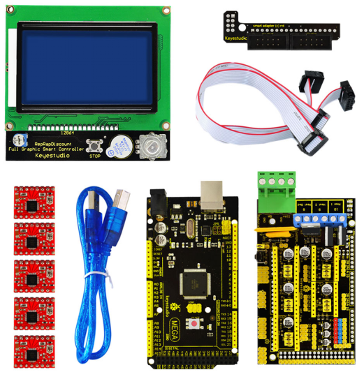

## 1. Description

**1.Keyestudio Mega 2560 board**

Keyestudio Mega 2560 R3 is a microcontroller board based on the ATMEGA2560. It has 54 digital input/output pins (of which 15 can be used as PWM outputs), 16 analog inputs, 4 UARTs (hardware serial ports), a 16 MHz crystal oscillator, a USB connection, a power jack, 2 ICSP headers, and a reset button. 

**2.LCD 12864 Smart Controller**

It contains a SD-Card reader. You can easy connect it to your Ramps board using the ""smart adapter"" included. After connecting this panel to your Ramps you don't need your pc any more, the Smart Controller supplies power for your SD card.

**3.RAMPS 1.4**

It is a Mega Pololu Shield, or RAMPS for short, designed to fit the entire electronics needed for a RepRap in one small package for low cost. RAMPS interfaces an Arduino Mega with the powerful Arduino MEGA platform and has plenty room for expansion.

The modular design includes plug in stepper drivers and extruder control electronics on an Arduino MEGA shield for easy service, part replacement, upgrade-ability and expansion. Additionally, a number of Arduino expansion boards can be added to the system as long as the main RAMPS board is kept to the top of the stack.

**4.A4988 stepper driver**

This product is a carrier board or breakout board for Allegro's A4988 DMOS Microstepping Driver with Translator and Overcurrent Protection by Pololu; we therefore recommend careful reading of the A4988 datasheet before using this product. This stepper motor driver lets you control one bipolar stepper motor at up to 2A output current per coil.

## 2. Package list

- 1pcs Keyestudio Mega2560
- 1pcs Lcd12864 smart Controller
- 1pcs Ramps 1.4
- 5pcs A4988 stepper driver
- 1pcs Panel Adapter
- 1pcs USB 2.0 cable

## 3. Connection Method

A. Mount 4988 correctly, don’t mount reversely, or they will be burnt, as shown below:

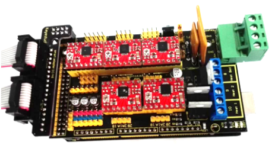

B. As for 2004LCD, firstly plug an adapter, then connect ESP1 to ESP1, ESP2 to ESP2, as shown below:

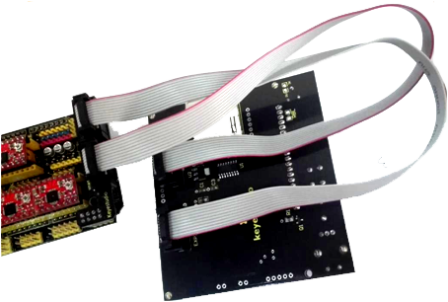

C. Connection Diagram as shown below:

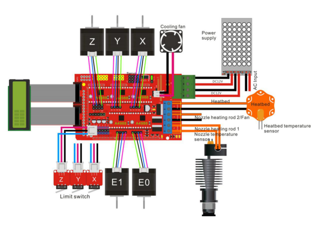

## 4.Using Method

**1. Install Diver Software**

**A.** For different operating system, there may be slight difference in installation method. Below is an example in WIN 7.

When you connect MEGA 2560 to your computer the first time, right click “Computer” —>“Properties”—> “Device manager”, you can see “Unknown devices”.

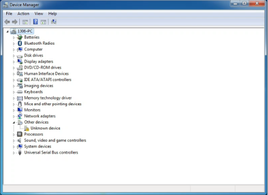

**B.** Click “Unknown devices”, select “Update Driver software”.

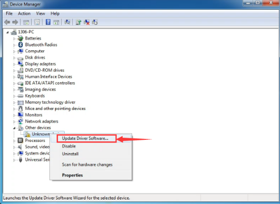

**C.** In this page, click “Browse my computer for driver software”.

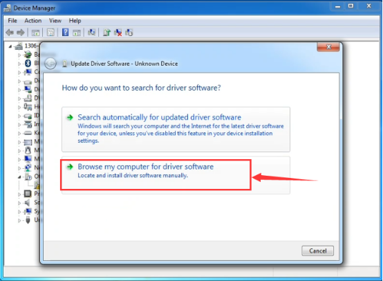

**D.** Find the “drivers” file. 

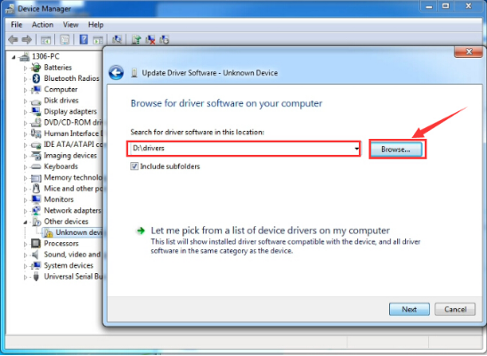

**E.** Click “Next”; select “Install this driver software anyway” to begin the installation.

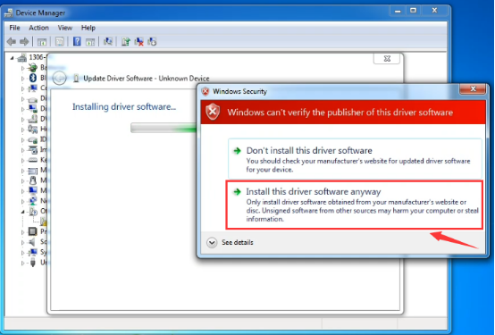

**F.** Installation completed; click “Close”.

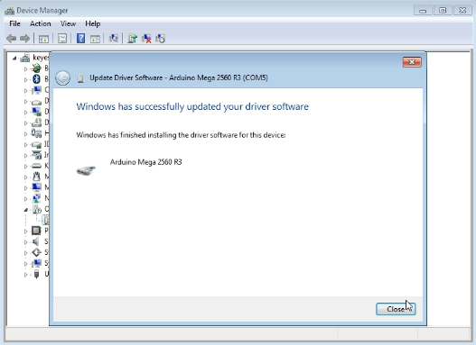

**G.** After driver is installed, go to “Device manager” again. Right click “Computer” —> “Properties”—> “Device manager”, you can see 2560 device as below figure shown, also the correct Com port.

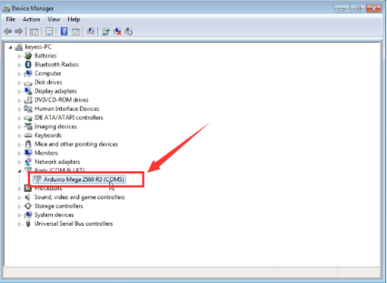

**2.Software Download**

Open the browser and search:  https://www.arduino.cc/en/software, we will take WINDOWS system as an example to show you how to download and install.

You just need to click JUSTDOWNLOAD,then click the downloaded file to install it.And when the ZIP file is downloaded,you can directly unzip and start it.

**3.Set Arduino IDE**

Connecting the board to the computer，and select the development board and port.

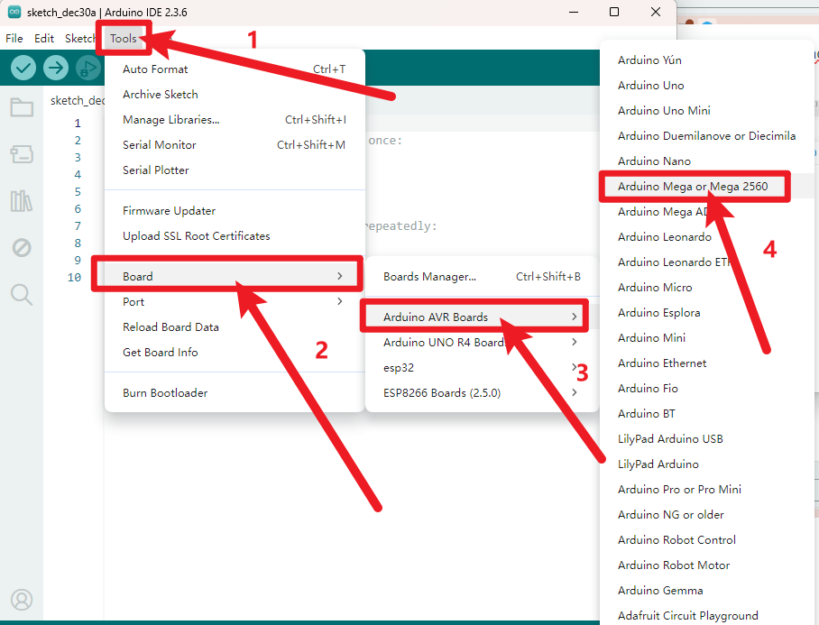

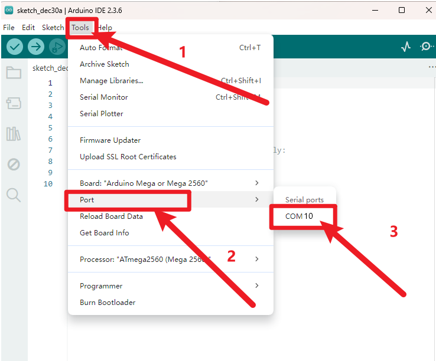

After upload the firmware, the LCD will display some parameter as shown below:

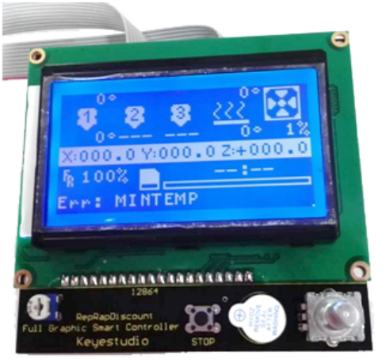

**4. Install Slicer Software Repetier-Host**

First, run this application.

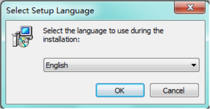

Click “Next” to continue.

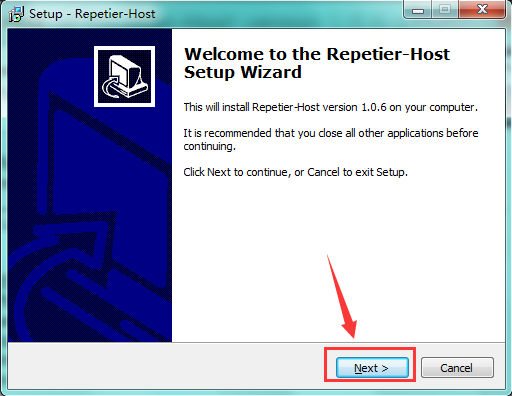

Check “I accept the agreement”, and click “Next” to continue.

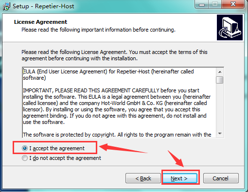

Select destination location, and click “Next” to continue.

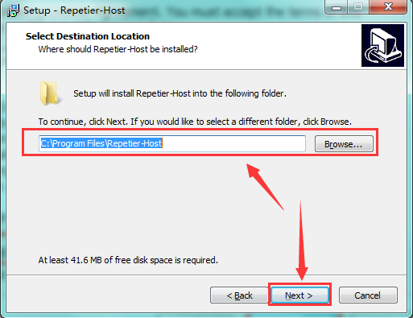

Check components that should be installed, and click “Next” to continue.

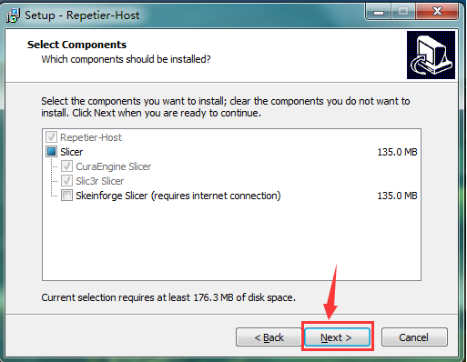

Select start menu folder, and click “Next” to continue.

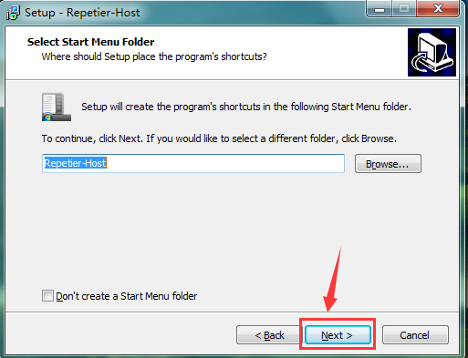

Click “Next” to continue.

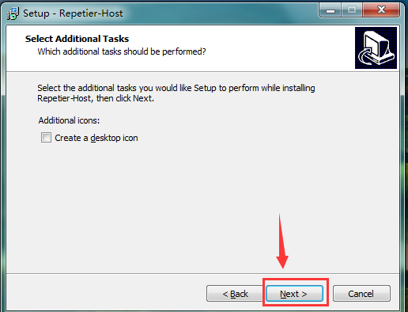

Click “Install” to install.

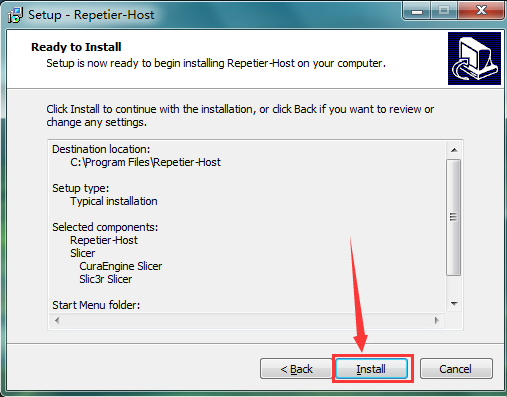

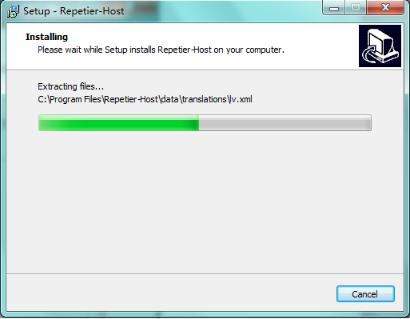

Click “Finish” to exit Setup.

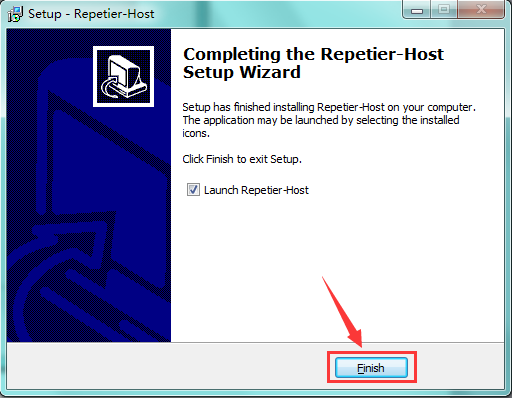

## 5. Application of Slicer Software

A. Run Repiter-Host,click **Load** to open a printing model.

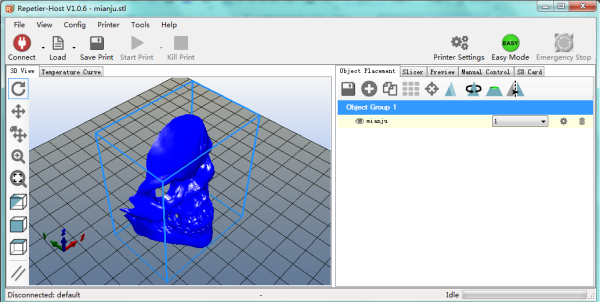

B. Click **Printer Settings** to complete some setup, referring to below figure.

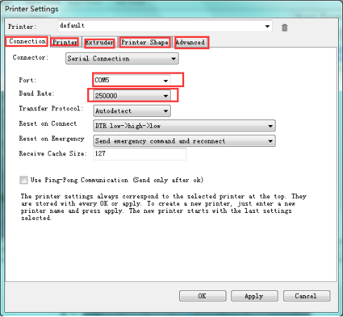

C. Enter **Object Placement** to set placing position, printing size and so on.

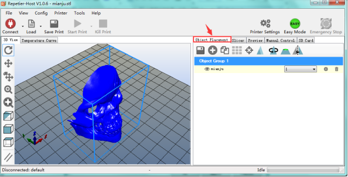

D. Click **Slicer** to set slicer, like printing speed. After setting slicer, click **Start Slicing** to begin slicing.

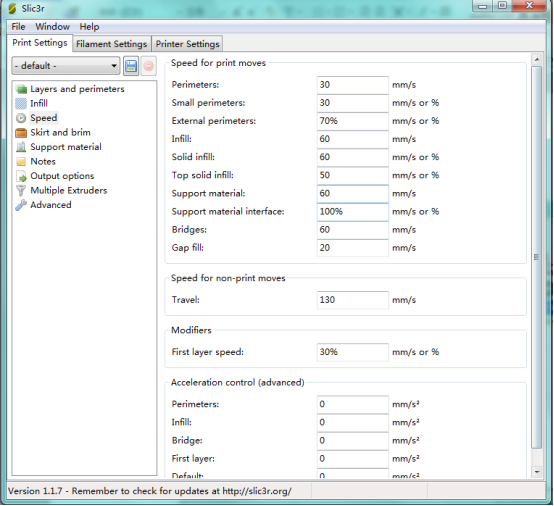

E. After slicing, go to **Preview→G-Code Editor**, copy G-Code to SD card, and then insert the card into the main board. It is time to kick off the print! The LCD screen goes to: Print from SD→Desired File. Or you can connect your 3D printer to computer using a USB cable to start the print.

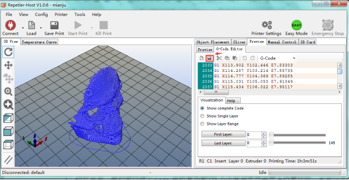

F. Click “Connect”and then click “Start Print” to begin the print. After some time, your printer gets ready and the buzzer rings, then you should press the button on LCD to start.

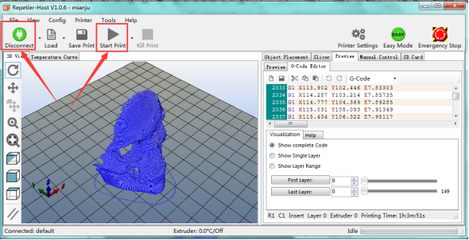

G. We just introduce a simple method about printing. You can design your own structure and outlook of your 3D printer, and also set your own configuration to meet your need.

After assembling your printer, the printer need to be leveled, so you can make some setup in **Preview** and **Manual Control**, and surf the internet for further information.

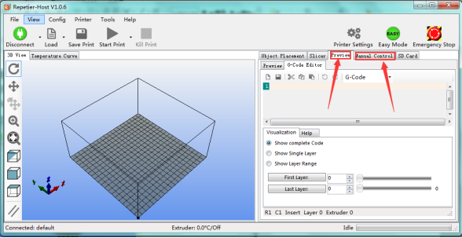

H. We have a G-Code to test the main board. Power it on, open limit switch and stepper motor, drive three motors; put a **Fnbduino.gco** file to Preview, click Start Print, if the motors rotate, X/Y/Z value in Manual Control changes, the main board works as shown below:

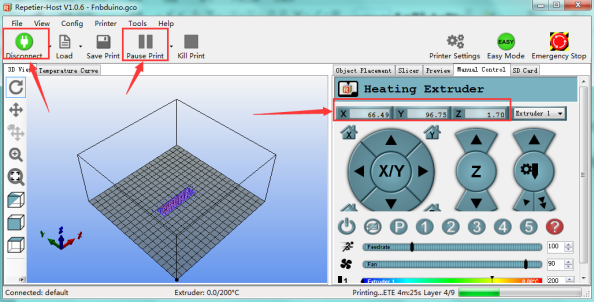